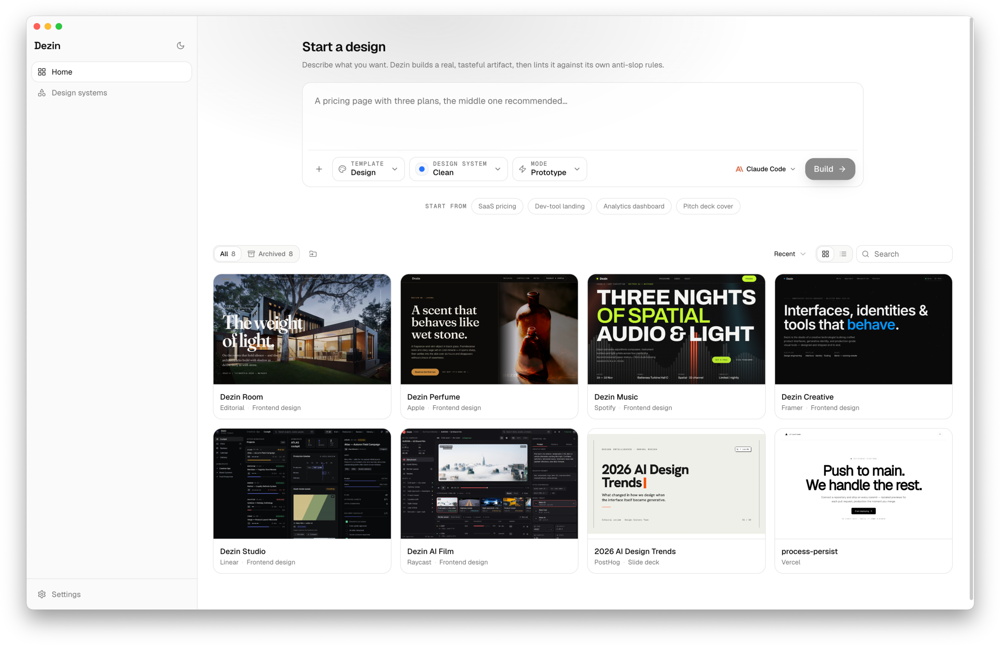

<div align="center">

# Dezin

**A local-first, tasteful design generator.**
Describe what you want; Dezin drives the coding-agent CLI you already have to build it as a real, self-contained artifact — and holds the output to a strict anti-AI-slop standard.

<br />



</div>

---

Dezin is deliberately minimal — no telemetry, no automation, no connectors, no paid model router, no plugin marketplace. Just the loop that makes generation good.

**BYOK, nothing leaves your machine.** Dezin shells out to a coding-agent CLI you already have installed and authenticated — Claude Code, Codex, Gemini CLI, Cursor Agent, CodeBuddy, Copilot, Qwen, opencode, or Aider. There is no Dezin account, no hosted inference, no API key to paste. The daemon binds to `127.0.0.1` and writes everything under `~/.dezin`.

## What makes it work

Three ideas do the work:

- **An anti-AI-slop quality kernel.** A deterministic linter flags the tells of machine-generated design — default Tailwind indigo, two-stop "trust" gradients, emoji-as-icons, invented metrics, filler copy, shadow-heavy cards — as P0 regressions, tuned to a neutral, borders-over-shadows aesthetic.
- **A closed lint → repair loop.** After the agent writes an artifact, it is linted, and any P0 finding feeds back as the next turn until it's clean. Anti-slop is enforced, not advised.
- **Optional visual QA.** When enabled, the selected agent reviews rendered screenshots and viewport geometry so obvious layout problems can be reported alongside static anti-slop findings.
- **One source of truth.** The linter's rule lists generate the craft doc (`content/craft/anti-ai-slop.md`); a drift test fails if they diverge, so the prompt and the linter can never disagree.

The default brand (`modern-minimal`) is a Linear/Vercel neutral grayscale that does not trip its own linter.

## Features

- **Bring your own agent.** Dezin scans your PATH for installed CLIs and lets you pick per-run, with the agent's real version. Models the agent exposes are selectable too.
- **Two build modes.** *Prototype* — one self-contained HTML file, fastest to iterate. *Standard* — a real Vite + React + GSAP project with components and routing.
- **33 built-in design systems.** Brand visual languages modelled on Airbnb, Apple, Linear, Stripe, Vercel, Notion, Figma, and more (each a 9-section `DESIGN.md` + tokens), plus neutral house styles. Import your own from a code folder or a `.fig` file.
- **Variant branches.** Fork a design into parallel branches, iterate each differently, then compare them side by side with a draggable before/after slider.
- **Files and Versions workspace.** Browse generated files with an in-pane source preview, and review per-branch versions grouped by branch with View, Diff, Compare, Restore, and Chat jump actions.
- **Durable run state.** Run events are persisted and replayed when you reopen a project or navigate back. In-app navigation can reconnect to a running agent; if the desktop app quits, the interrupted run reopens at its last known state.
- **Reference real work.** Attach another project as a reference (its actual artifact is handed to the agent), drop in screenshots to recreate, or paste local paths.
- **Live process view.** The agent's reasoning and file writes stream into the chat as it works; the artifact renders in a sandboxed iframe; export downloads a `.zip`.
- **Desktop app.** An Electron shell (`apps/desktop`) with native window chrome and pixel-perfect off-screen capture for previews.
- **Chrome extension.** Capture a cover image from Dribbble / Behance / Pinterest and send it straight to the composer (`apps/extension`).
- **Command palette, dark mode, keyboard-first.** The usual niceties, done with restraint.

## Quick start

Prerequisites: **Node ≥ 22.12**, **pnpm 11**, and at least one **coding-agent CLI on your PATH** (e.g. `claude`), authenticated, for real generation.

```sh
pnpm install      # install the workspace
pnpm dev          # runs the daemon + the web UI together (Ctrl-C stops both)
```

`pnpm dev` starts the Node daemon and the Vite dev server; open the printed URL, describe a design, pick a mode and a design system, choose your agent, and **Build**. Run events stream into the chat as the artifact takes shape.

The stack is deliberately **hermetic**: the backend runs on Node built-ins (`node:http`, `node:sqlite`) with TypeScript type-stripping, so it runs and tests with just `node` — no build step, no native modules.

### Desktop

```sh
pnpm desktop      # build the web app and launch the Electron shell
```

### Configuration

The daemon reads a few environment variables:

| Var | Default | Purpose |
| --- | --- | --- |
| `DEZIN_PORT` | ephemeral | Fixed port (dev uses `7457`; production is portless via `.dezin/daemon.json`) |
| `DEZIN_HOST` | `127.0.0.1` | Bind address |
| `DEZIN_DATA_DIR` | `~/.dezin` | Where projects, the SQLite DB, and imported systems live |
| `DEZIN_AGENT_CMD` | `claude` | Default agent command |

## Architecture

A pnpm monorepo.

```
packages/
  quality/   anti-slop linter + the lint→repair closed loop (the headline)
  core/      node:sqlite metadata store (projects/conversations/messages/runs)
  prompt/    composeSystemPrompt — a layered system prompt
  agent/     AgentRunner + generateArtifact (wires the loop) + per-CLI runners
  design/    bundled design systems + loader (registry of DESIGN.md brands)
  skills/    SKILL.md loader (artifact shapes)
  craft/     generates the anti-slop doc from quality's rule lists + a drift test
apps/
  daemon/    node:http server: runs, project CRUD, agent scan, static preview, ZIP export
  web/       Vite + React 19 + Tailwind v4 SPA — the workspace UI
  desktop/   Electron shell + off-screen capture
  extension/ Chrome extension — capture a cover image into the composer
content/
  skills/          authored SKILL.md workflows (artifact shapes)
  design-systems/  the 33 built-in brands (DESIGN.md + tokens.css + manifest)
  craft/           generated anti-ai-slop.md
```

Generation is driven by a **3-axis content model**: `skills` (what to build) × `design-systems` (the brand visual language) × `craft` (universal anti-slop rules). All three are composed into one system prompt and handed to the agent, which writes files into the project folder. The result is linted; P0 findings re-enter as the next turn until clean.

## Test

```sh
pnpm test                      # node suite across packages + daemon
pnpm --filter @dezin/web test  # web suite (vitest)
pnpm typecheck                 # type-check every package
```

The node suite uses `node --experimental-strip-types --experimental-sqlite --test` across every package; no dependencies required.

## Docs

- [`ROADMAP.md`](./ROADMAP.md) — what's shipped and what's still a TODO.
- [`CONTRIBUTING.md`](./CONTRIBUTING.md) — how to build, test, and send a change.
- [`docs/SELF-DESIGN.md`](./docs/SELF-DESIGN.md) — how Dezin's own UI follows Dezin's rules.

## License

[MIT](./LICENSE).

## References

Dezin was built from scratch; its direction was informed by ideas from these projects:

- [open-design](https://github.com/nexu-io/open-design) — for the anti-AI-slop craft direction and the idea of composing generation from a brand/system content model.
- [Claude Design](https://claude.ai) — Anthropic's Claude interface, a touchstone for the restrained, content-first product aesthetic Dezin aims for.
- [simple-icons](https://github.com/simple-icons/simple-icons) — the brand marks used for the built-in design systems.
