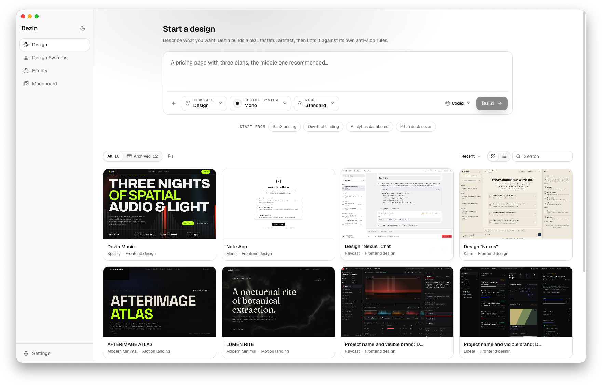
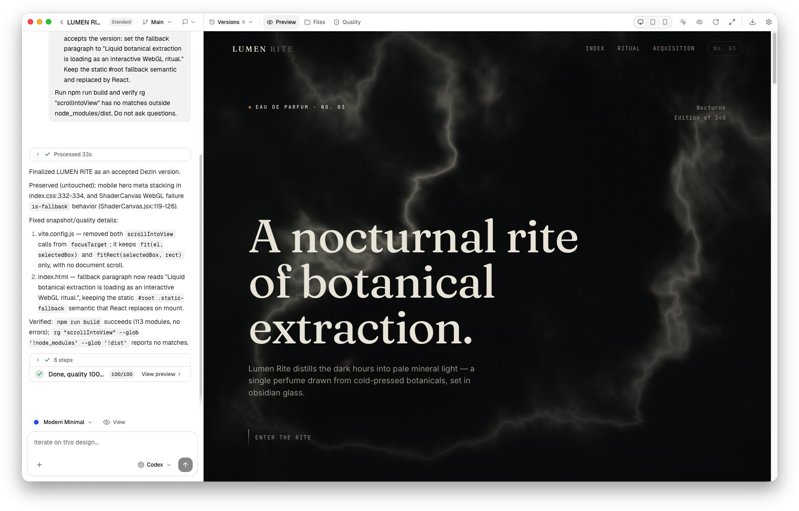
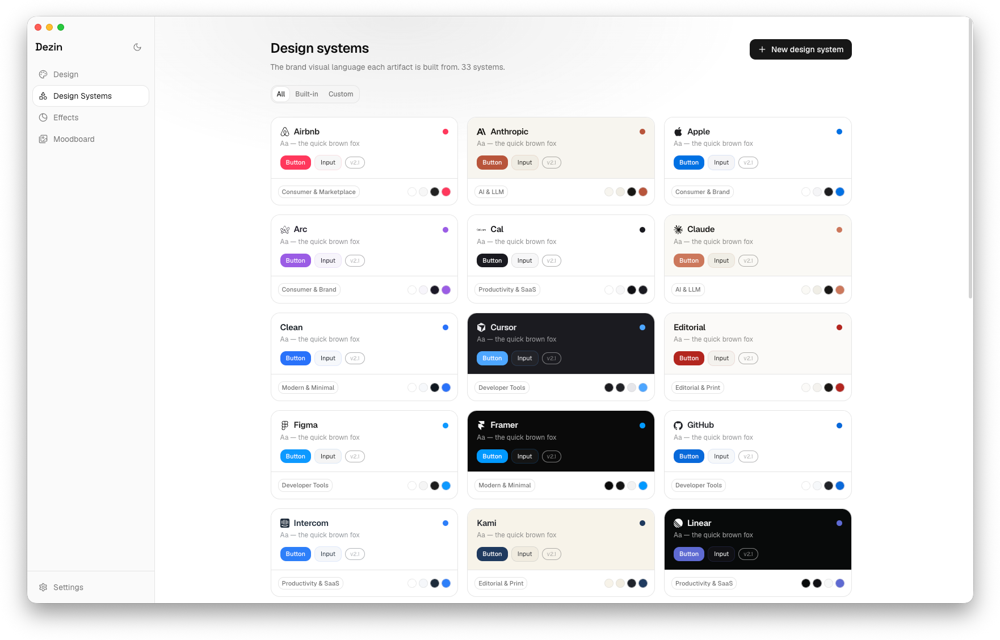
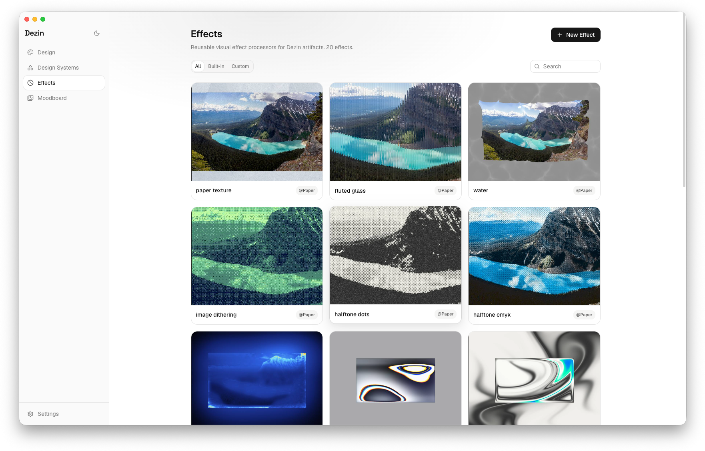
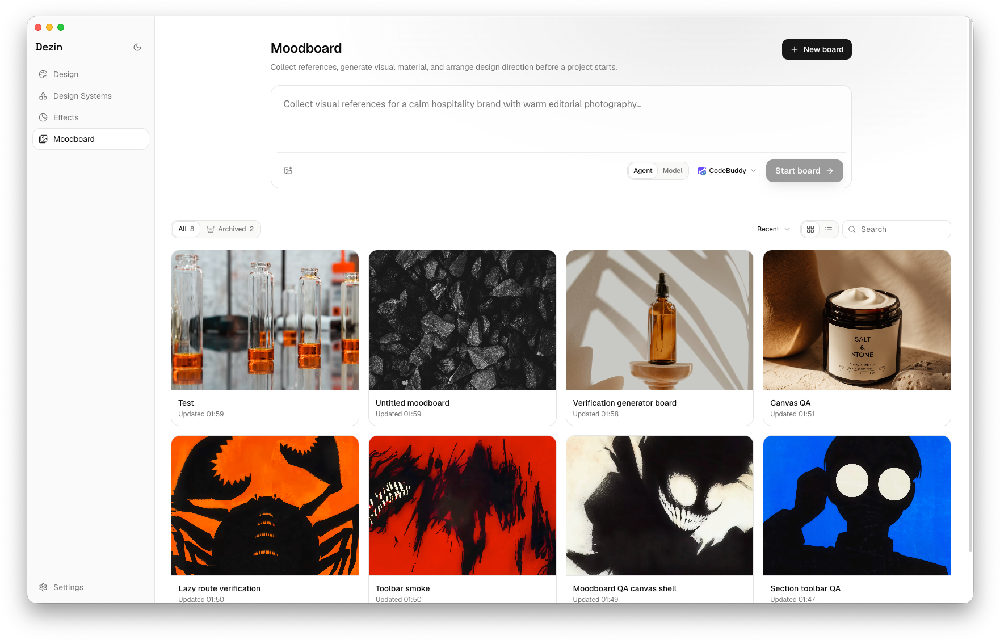
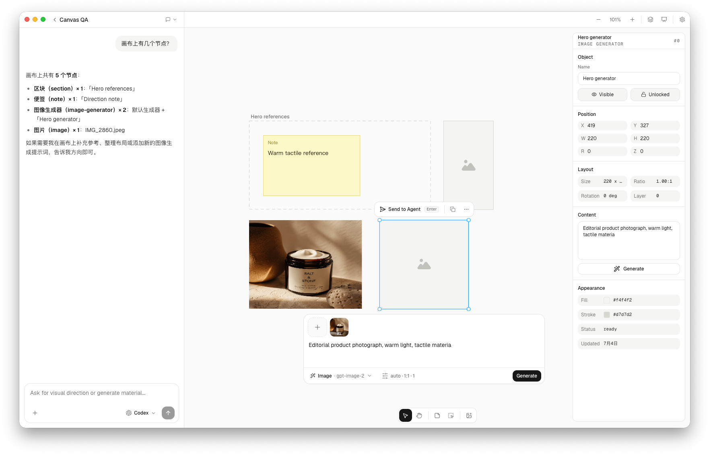

<div align="center">

# Dezin

**一个本地优先、有品位的设计生成器。**
描述你想要什么；Dezin 会驱动你已经装好的编码 Agent CLI，把它构建成一个真实、自包含的产物 —— 并用一套严格的反 AI 塑料感标准来约束输出。

[English](./README.md) · 简体中文

<br />



</div>

---

Dezin 刻意保持极简 —— 没有遥测，没有托管自动化，没有连接器，没有付费的模型路由，没有插件市场。只有那些让生成变好的本地循环。

**自带密钥（BYOK），数据不出你的机器。** Dezin 会调用你已经安装并登录好的编码 Agent CLI —— Claude Code、Codex、Gemini CLI、Cursor Agent、CodeBuddy、Copilot、Qwen、opencode、Kimi CLI、Trae CLI、Pi 或 Hermes。没有 Dezin 账号，没有托管推理，也不用粘贴任何 API key。守护进程绑定到 `127.0.0.1`，所有内容都写在 `~/.dezin` 下。

## 核心机制

三个想法撑起了它：

- **反 AI 塑料感的质量内核。** 一个确定性的 linter 会把机器生成设计的种种破绽 —— 默认的 Tailwind 靛蓝、双色标"信任感"渐变、拿 emoji 当图标、编造的指标、注水文案、堆满阴影的卡片 —— 标记为 P0 级回归，并向一套中性、以描边取代阴影的美学看齐。
- **闭环的质量 → 修复循环。** Agent 写完产物后，Dezin 会跑静态 lint、渲染后的几何检查，以及可选的 Agent 视觉评审。阻塞性的 P0/P1 问题会自动作为修复回合反馈回去，直到达到配置的回合上限。质量是被强制的，而不是被建议的。
- **带运行时证据的 Agent 视觉评审。** 启用后，评审 Agent 会检查渲染出的截图、视口几何、当前对话上下文，以及浏览器运行时信号 —— 例如控制台错误、页面错误、失败的请求和 HTTP 错误响应。评审方可以沿用项目的 Agent/模型，也可以用它自己的 Agent + 模型。
- **单一事实来源。** linter 的规则清单会生成工艺文档（`content/craft/anti-ai-slop.md`）；一个漂移测试会在两者出现分歧时失败，因此提示词和 linter 永远不会各说各话。

默认品牌（`modern-minimal`）是一套 Linear/Vercel 风格的中性灰阶，不会触发它自己的 linter。

<div align="center">
  
  <p><em>一次 Standard 运行 —— Agent 的推理和文件写入在左侧实时流动，产物在右侧实时渲染，每个版本都带着自己的质量分落地。</em></p>
</div>

## 功能

- **自带 Agent。** Dezin 会扫描你 PATH 上已安装的 CLI，让你按次运行时挑选，并显示该 Agent 的真实版本。Agent 暴露出的模型同样可选。
- **可配置的质量自动化。** 视觉评审可以跑在项目的 Agent/模型上，也可以跑在单独的评审 Agent/模型上；自动改进默认为 8 个修复回合。
- **两种构建模式。** *Prototype（原型）* —— 单个自包含的 HTML 文件，迭代最快。*Standard（标准）* —— 一个真正的 Vite + React + GSAP 项目，带组件和路由。
- **33 个内置设计系统。** 以 Airbnb、Apple、Linear、Stripe、Vercel、Notion、Figma 等为原型的品牌视觉语言（每个都是 9 段式的 `DESIGN.md` + tokens），外加中性的自有风格。也可以从代码文件夹或 `.fig` 文件导入你自己的。
- **特效库。** 20 个内置 `@Paper` 视觉特效 —— 图像滤镜（纸张纹理、竖纹玻璃、半调、抖动）和生成式着色器（网格/径向渐变、God Rays、烟雾、Metaballs）—— 通过 Paper Shaders 渲染，每个都带预设和实时参数面板。你也可以自己写 WebGL2/GLSL 特效，并让 Agent 在预览保持实时的同时修改它们。
- **变体分支。** 把一个设计分叉成多个并行分支，各自以不同方式迭代，然后用可拖拽的前后对比滑块并排比较。
- **文件与版本工作区。** 浏览生成的文件，并在面板内预览源码；按分支查看每个分支的版本，支持查看、Diff、对比、还原以及跳转到对话等操作。
- **持久化的运行状态。** 运行事件会被持久化，并在你重新打开项目或返回时回放。应用内导航可以重新连接到正在运行的 Agent；如果桌面应用退出了，被打断的运行会在它最后的已知状态处重新打开。
- **情绪板（Moodboard）。** 在设计开始前，于一块高性能、AI 原生的无限画布上收集参考 —— 在图片、便签、区块和图像生成器节点之间自由平移缩放，就地生成视觉素材，并由一个板级 Agent 统一驱动。基于 Leafer 引擎打造，带来流畅、接近 Lovart 的画布体验，且完全本地。
- **引用真实成果。** 把另一个项目作为参考附上（它真实的产物会交给 Agent）、引用一块情绪板（带预算的画布上下文与素材路径）、拉入一个内置或自定义特效、丢入截图来复刻，或者粘贴本地路径。
- **实时过程视图。** Agent 工作时，它的推理和文件写入会实时流入对话；产物在沙箱化的 iframe 中渲染；导出会下载一个 `.zip`。
- **桌面应用。** 一个 Electron 外壳（`apps/desktop`），带原生窗口边框，以及用于预览的像素级精确离屏截图。
- **Chrome 扩展。** 从 Dribbble / Behance / Pinterest 抓取一张封面图，直接发送到输入框（`apps/extension`）。
- **命令面板、暗色模式、键盘优先。** 该有的贴心细节都在，且克制。

## 界面一览

<div align="center">
  
  <p><em>33 个内置设计系统，每个都是带有自己 tokens 的品牌视觉语言 —— 或者从代码文件夹或 <code>.fig</code> 文件导入你自己的。</em></p>
</div>

<div align="center">
  
  <p><em>特效库 —— 20 个内置 <code>@Paper</code> 视觉特效，从图像滤镜到生成式着色器，每个都带有实时参数与预设。</em></p>
</div>

<div align="center">
  
  <p><em>情绪板 —— 在设计开始前收集参考、生成视觉素材。</em></p>
</div>

<div align="center">
  
  <p><em>情绪板画布 —— 一块高性能、AI 原生的无限画布，容纳图片、便签、区块和图像生成器节点，配一个板级 Agent 面板。</em></p>
</div>

## 快速开始

前置要求：**Node ≥ 22.12**、**pnpm 11**，以及至少一个位于 **PATH 上、且已登录的编码 Agent CLI**（例如 `claude`），用于真实生成。

```sh
pnpm install      # 安装工作区依赖
pnpm dev          # 一起启动守护进程 + Web UI（Ctrl-C 一并停止）
```

`pnpm dev` 会启动 Node 守护进程和 Vite 开发服务器；打开打印出的 URL，描述一个设计，选择模式和设计系统，挑选你的 Agent，然后点击 **Build**。随着产物逐渐成形，运行事件会实时流入对话。

整个技术栈刻意做到**自足（hermetic）**：后端跑在 Node 内建模块（`node:http`、`node:sqlite`）上，配合 TypeScript 类型剥离，因此只用 `node` 就能运行和测试 —— 无需构建步骤，无原生模块。

### 桌面端

```sh
pnpm desktop      # 构建 Web 应用并启动 Electron 外壳
```

### 配置

守护进程会读取几个环境变量：

| 变量 | 默认值 | 用途 |
| --- | --- | --- |
| `DEZIN_PORT` | 临时端口 | 固定端口（开发环境用 `7457`；生产环境无固定端口，通过 `.dezin/daemon.json` 记录） |
| `DEZIN_HOST` | `127.0.0.1` | 绑定地址 |
| `DEZIN_DATA_DIR` | `~/.dezin` | 项目、SQLite 数据库和导入的设计系统的存放位置 |
| `DEZIN_AGENT_CMD` | `claude` | 默认 Agent 命令 |

## 架构

一个 pnpm monorepo。

```
packages/
  quality/   反 AI 塑料感 linter + lint→修复闭环（核心亮点）
  core/      node:sqlite 元数据存储（项目/对话/消息/运行）
  prompt/    composeSystemPrompt —— 分层系统提示词
  agent/     AgentRunner + generateArtifact（串起整个循环）+ 各 CLI 的 runner
  design/    内置设计系统 + 加载器（DESIGN.md 品牌注册表）
  effects/   内置 @Paper 视觉特效（Paper Shaders 元数据）+ 自定义 GLSL 特效模型
  skills/    SKILL.md 加载器（产物形态）
  craft/     从 quality 的规则清单生成反塑料感文档 + 一个漂移测试
apps/
  daemon/    node:http 服务：运行、项目 CRUD、Agent 扫描、静态预览、ZIP 导出
  web/       Vite + React 19 + Tailwind v4 SPA —— 工作区、设计系统、特效 + 情绪板画布（Leafer）
  desktop/   Electron 外壳 + 离屏截图
  extension/ Chrome 扩展 —— 把封面图抓取到输入框
content/
  skills/          手写的 SKILL.md 工作流（产物形态）
  design-systems/  33 个内置品牌（DESIGN.md + tokens.css + manifest）
  craft/           生成的 anti-ai-slop.md
```

生成过程由一个**三轴内容模型**驱动：`skills`（构建什么）× `design-systems`（品牌视觉语言）× `craft`（通用的反塑料感规则）。三者被组合进同一份系统提示词，交给 Agent，由它把文件写入项目文件夹。产物随后被 linter 检查；P0 问题会作为下一回合重新进入，直到干净为止。情绪板是一个独立的本地数据模型，用于设计前的素材收集；项目可以引用它们，而无需把整块板子塞进对话历史。

## 测试

```sh
pnpm test                      # 跨各 package + daemon 的 node 测试套件
pnpm --filter @dezin/web test  # Web 测试套件（vitest）
pnpm typecheck                 # 对每个 package 做类型检查
```

node 测试套件在每个 package 上使用 `node --experimental-strip-types --experimental-sqlite --test`，无需任何依赖。

## 文档

- [`ROADMAP.md`](./ROADMAP.md) —— 已经交付了什么、还有哪些 TODO。
- [`CONTRIBUTING.md`](./CONTRIBUTING.md) —— 如何构建、测试并提交改动。
- [`docs/SELF-DESIGN.md`](./docs/SELF-DESIGN.md) —— Dezin 自己的 UI 如何遵循 Dezin 的规则。

## 许可证

[MIT](./LICENSE)。

## 参考

Dezin 从零构建；它的方向受到了以下项目的启发：

- [open-design](https://github.com/nexu-io/open-design) —— 反 AI 塑料感的工艺方向，以及从品牌/系统内容模型来组合生成的思路。
- [Claude Design](https://claude.ai) —— Anthropic 的 Claude 界面，是 Dezin 所追求的那种克制、以内容为先的产品美学的标杆。
- [simple-icons](https://github.com/simple-icons/simple-icons) —— 内置设计系统所用的品牌图标。
- [Paper Shaders](https://github.com/paper-design/shaders) —— Dezin 内置 `@Paper` 特效背后的着色器预设与参数默认值（Apache-2.0）。
